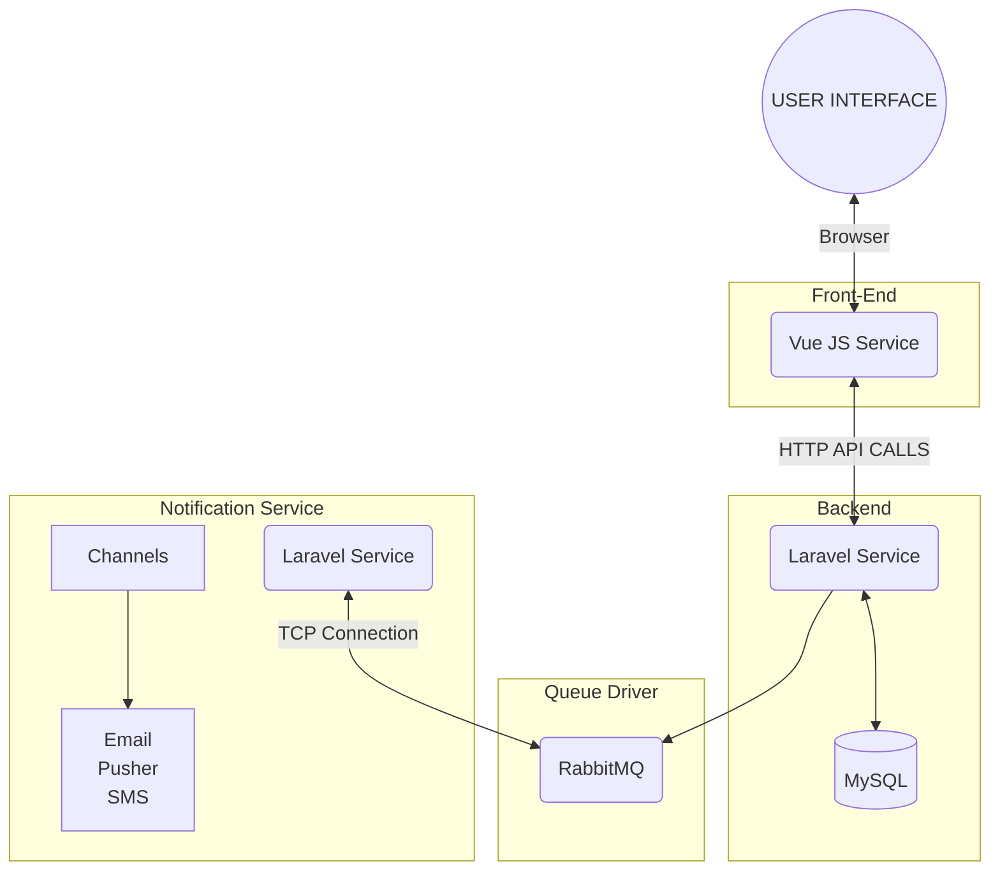
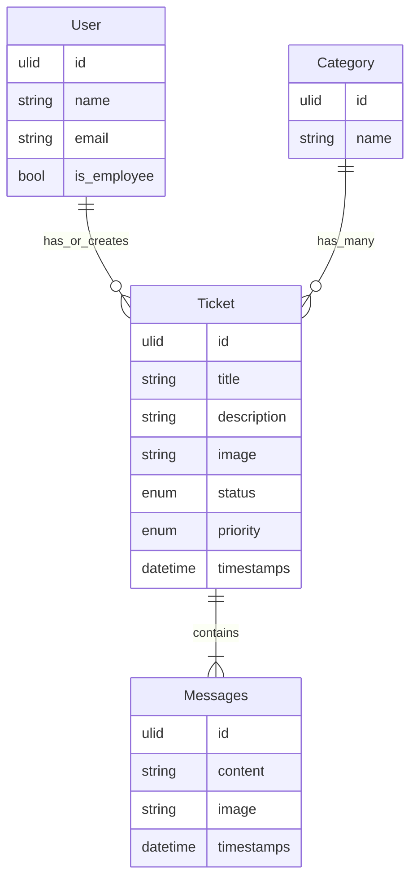

# Full Documentation!

Hello everyone!

welcome to the documentation for the **Comprehensive Technology Documentation** project. This document serves as a comprehensive guide for understanding, setting up, and using our project. Whether you're a developer contributing to the project or a user looking to make the most of our technology, you'll find valuable information and resources here.

# Project Name

 

## Project Overview

 

## What You'll Find in this Documentation

This documentation is divided into various sections, each addressing a specific aspect of our project. Here's a brief overview of what you can expect to find:

- **System Architecture Design**: Explore the system's architecture, including components, interactions, and diagrams.
- **Installation and Setup**: Learn how to set up your development environment and install necessary dependencies.
- **Database Schema**: Discover the database schema, including tables and relationships.

- **User Guide**: Learn how to use our technology effectively, with step-by-step guides and user instructions.

- **Security Considerations**: Find out about security measures and best practices to keep your data and applications secure.

**Let's get started!** Explore the sections that interest you the most and feel free to reach out if you have any questions or need further assistance.

## System Architecture Design

And this will produce a flow chart:

## Installation and Setup

This excercise is composed by 3 services, which are:
-- **Vue Js** Front End Service
-- **Laravel** Back End Service
-- **Laravel** Notification Service

**Backend service**
The installation process is described at
https://github.com/Samuel-Bie/helpdesk-backend/blob/master/README.md

  **Notification service**
  The installation process is described at
  https://github.com/Samuel-Bie/helpdesk-notification-service/blob/master/README.md

  **Front end service**
The installation process is described at
https://github.com/Samuel-Bie/helpdesk-frontend/blob/master/README.md

## Database Schema

## Security Considerations

The comunication between fron and backend are protected by Laravel Sanctum authentication.

Database has passwords

Our queue driver is protected by a username and password
