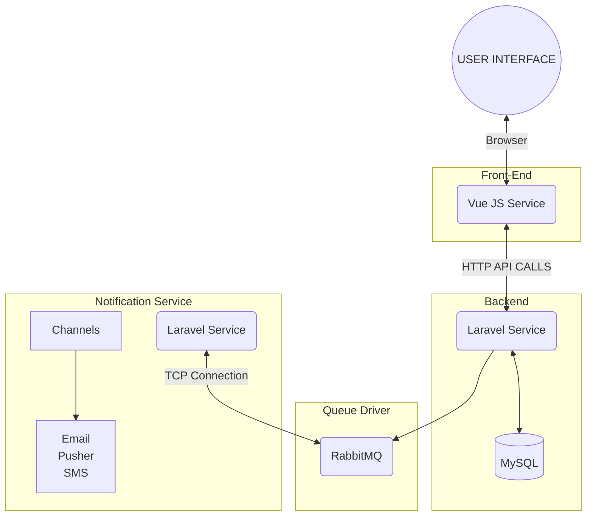

# Full Documentation!

Hellow everyone!

welcome to the documentation for the **Comprehensive Technology Documentation** project. This document serves as a comprehensive guide for understanding, setting up, and using our project. Whether you're a developer contributing to the project or a user looking to make the most of our technology, you'll find valuable information and resources here.

# Project Name

Welcome to the documentation for the **Comprehensive Technology Documentation** project. This document serves as a comprehensive guide for understanding, setting up, and using our project. Whether you're a developer contributing to the project or a user looking to make the most of our technology, you'll find valuable information and resources here.

## Project Overview

The **Comprehensive Technology Documentation** project is dedicated to providing a robust and clear resource for team members and users alike. It is designed to help developers understand the inner workings of the project, facilitate smooth onboarding, and enable efficient troubleshooting. For end-users, this documentation offers guidance on using our technology to its fullest potential.

## What You'll Find in this Documentation

This documentation is divided into various sections, each addressing a specific aspect of our project. Here's a brief overview of what you can expect to find:

- **System Architecture Design**: Explore the system's architecture, including components, interactions, and diagrams.
- **Installation and Setup**: Learn how to set up your development environment and install necessary dependencies.
- **Project Structure**: Get familiar with the directory structure and the organization of our codebase.

- **Getting Started**: Find quick start instructions for running the project.

- **Configuration**: Understand how to configure the project for different environments and settings.

- **Code Documentation**: Explore the codebase with detailed explanations, comments, and examples.

- **API Documentation** (if applicable): Get to know our API, its endpoints, request methods, and response data.

- **Database Schema**: Discover the database schema, including tables and relationships.

- **User Guide**: Learn how to use our technology effectively, with step-by-step guides and user instructions.

- **Security Considerations**: Find out about security measures and best practices to keep your data and applications secure.

- **Version Control**: Discover how version control is managed in the project and how to contribute.

We believe that this comprehensive guide will provide clarity and insight into our project, making it easier for team members and users to harness the full potential of our technology.

**Let's get started!** Explore the sections that interest you the most and feel free to reach out if you have any questions or need further assistance.

## System Architecture Design

And this will produce a flow chart:

## Installation and Setup

This excercise is composed by 3 services, which are:
-- Vue Js Front End Service
-- Laravel Back End Service
-- Laravel Notification Service

  **Front end service**
The installation process is described at https://github.com/Samuel-Bie/helpdesk-frontend/blob/master/README.md

**Backend service**
